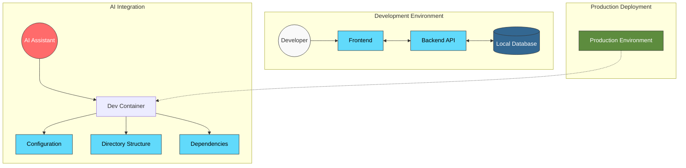

# AI-Ready Dev Containers

This repository contains development containers optimized for AI development workflows.

## Repository Information

- GitHub: [mattsilv/ai-ready-dev-containers](https://github.com/mattsilv/ai-ready-dev-containers)

## Overview

This repository provides templates and best practices for creating consistent development environments using Dev Containers. The configurations are designed to be:

1. **AI-Agent Compatible**: Optimized for use with AI coding assistants like GitHub Copilot, Cursor, and others
2. **Reproducible**: Ensuring consistent development experiences across team members
3. **Production-Ready**: Configurable to match production environments
4. **Flexible**: Adaptable to various tech stacks and frameworks

## Architecture

The templates follow a consistent architecture pattern that can be customized for different tech stacks:



## Getting Started

### Prerequisites

- [Docker](https://www.docker.com/products/docker-desktop/)
- [VS Code](https://code.visualstudio.com/)
- [Dev Containers Extension](https://marketplace.visualstudio.com/items?itemName=ms-vscode-remote.remote-containers)

### Quick Start

1. Clone this repository:

   ```bash
   git clone https://github.com/yourusername/ai-ready-dev-containers.git
   ```

2. Choose a template that matches your tech stack (e.g., React + FastAPI + PostgreSQL)

3. Copy the template files to your project:

   ```bash
   cp -r templates/react-fastapi-postgres/* /path/to/your/project/
   ```

4. Customize the configuration files as needed

5. Open your project in VS Code and click "Reopen in Container" when prompted

## Available Templates

- [React + FastAPI + PostgreSQL](./templates/react-fastapi-postgres/README.md)
- [Next.js + Express + MongoDB](./templates/nextjs-express-mongodb/README.md)
- [Vue + NestJS + MySQL](./templates/vue-nestjs-mysql/README.md)

## Documentation

- [Detailed Setup Guide](./docs/DETAILED_SETUP.md) - Comprehensive instructions for setting up dev containers
- [Cursor IDE Rules](./docs/CURSOR_RULES.md) - Instructions for configuring AI coding assistants
- [Local Development](./docs/LOCAL_DEVELOPMENT.md) - Guide for local development workflows
- [Production Deployment](./docs/PRODUCTION_DEPLOYMENT.md) - Matching production environments to local development

## Best Practices

- **Version Control**: Keep all configuration in version control
- **Environment Separation**: Use different environment variables for development and production
- **Migration Management**: Use database migration tools for schema changes
- **Consistent Development Environments**: Ensure all team members use the same environment

## Community Contributions

We welcome contributions from the community! Please check our [Contribution Guidelines](./CONTRIBUTING.md) before submitting pull requests.

## License

This project is licensed under the MIT License - see the [LICENSE](./LICENSE) file for details.
