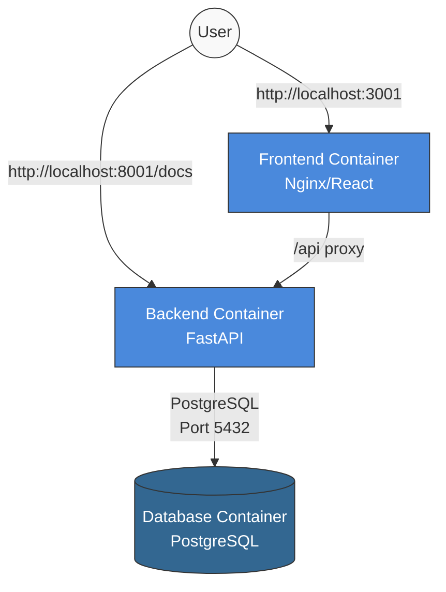

# Dev Container Demo - React + FastAPI + PostgreSQL

This is a working demonstration of a development environment using Docker containers with React frontend, FastAPI backend, and PostgreSQL database.

## Architecture



## Project Structure

```
demo/
├── .devcontainer/              # Dev container configuration
│   ├── devcontainer.json       # Container configuration
│   └── docker-compose.yml      # Services configuration
├── .docker/
│   ├── postgres-data/          # PostgreSQL data (created at runtime)
│   └── init-scripts/           # Database initialization scripts
│       └── setup.sql           # Runs when the database is first created
├── backend/                    # FastAPI backend application
│   ├── Dockerfile              # Multi-stage build for backend
│   ├── alembic.ini             # Database migration configuration
│   ├── migrations/             # Database migrations directory
│   ├── requirements.txt        # Python dependencies
│   └── src/                    # Application source code
│       ├── main.py             # FastAPI application entry point
│       ├── database.py         # Database connection setup
│       ├── models.py           # SQLAlchemy database models
│       └── schemas.py          # Pydantic models for API validation
├── frontend/                   # React frontend application
│   ├── Dockerfile              # Multi-stage build for frontend
│   ├── package.json            # Node.js dependencies
│   ├── vite.config.js          # Vite configuration
│   └── src/                    # Application source code
│       ├── App.jsx             # Main React component
│       ├── App.css             # Component styling
│       ├── main.jsx            # React application entry point
│       └── index.css           # Global styles
└── START_HERE.sh               # Single entry point script to run the demo
```

## Getting Started

### Prerequisites

- [Docker](https://www.docker.com/products/docker-desktop/)

### Running the Demo

The demo has a single entry point script that handles everything:

```bash
# Navigate to the demo directory if you're not already there
cd path/to/ai-ready-dev-containers/demo

# Make sure the script is executable
chmod +x START_HERE.sh

# Run the script
./START_HERE.sh
```

This script will:

1. Check if Docker is installed
2. Create necessary directories
3. Stop any existing containers
4. Start the containers directly (so you can access the app immediately)

You can access the application directly in your browser:

- Frontend: http://localhost:3001
- API docs: http://localhost:8001/docs

## Development Workflow

Once your Dev Container environment is running:

### Backend Development

```bash
# Create and apply database migrations
cd /app  # This is the backend container working directory
alembic revision --autogenerate -m "Initial migration"
alembic upgrade head

# Run tests (if added)
pytest

# The FastAPI app auto-reloads when code changes
```

### Frontend Development

```bash
# Install additional packages
cd /app  # This is the frontend container working directory
npm install some-package

# The React app auto-reloads when code changes
```

### Database Access

```bash
# Connect to PostgreSQL
psql -h db -U user -d demo_db
# Password: password
```

## Features

This demo showcases several key features of Dev Containers:

1. **Consistent Development Environment**: All developers use the same environment with identical versions of Python, Node.js, and PostgreSQL.

2. **Isolated Dependencies**: Each service has its own isolated dependencies, preventing conflicts.

3. **Multi-Stage Dockerfiles**: Both frontend and backend use multi-stage builds to optimize for both development and production.

4. **Auto-Reload**: Both the FastAPI backend and React frontend automatically reload when code changes are made.

5. **Database Migrations**: Alembic is set up for managing database schema changes.

6. **API Documentation**: FastAPI's automatic OpenAPI documentation is available at `/docs`.

7. **CORS Configured**: The backend is configured to allow requests from the frontend.

8. **Hello World Demo App**: A simple demo application is included that demonstrates the full stack, with a React frontend fetching data from the PostgreSQL database via the FastAPI backend.

## Hello World Demo App

The demo includes a simple "Hello World" application to demonstrate the full stack:

- **React Frontend**: A clean UI that shows database items and allows adding new ones
- **FastAPI Backend**: Provides API endpoints to interact with the database
- **PostgreSQL Database**: Stores the items with sample data

You can test the connectivity between all three components:

1. Visit the frontend at http://localhost:3000
2. The frontend will display items from the database, fetched through the backend API
3. You can add new items through the UI, which will be saved to the database

This demonstrates the complete full-stack functionality within the dev container environment.

## Customizing This Demo

This demo provides a starting point that you can customize for your own projects:

1. **Change Database Schema**: Modify `backend/src/models.py` to define your database schema
2. **Modify API Endpoints**: Update `backend/src/main.py` to change or add API endpoints
3. **Update React Components**: Modify files in the `frontend/src` directory
4. **Change Environment Variables**: Update the environment variables in `.devcontainer/docker-compose.yml`
